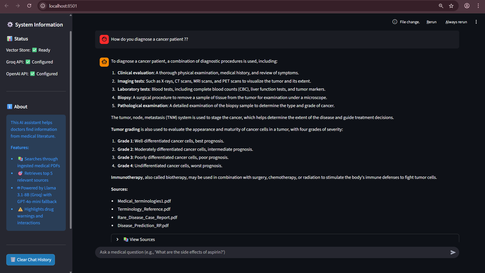
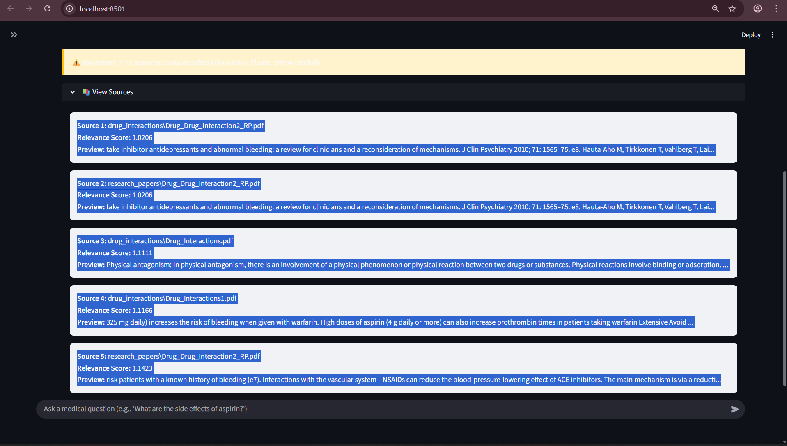
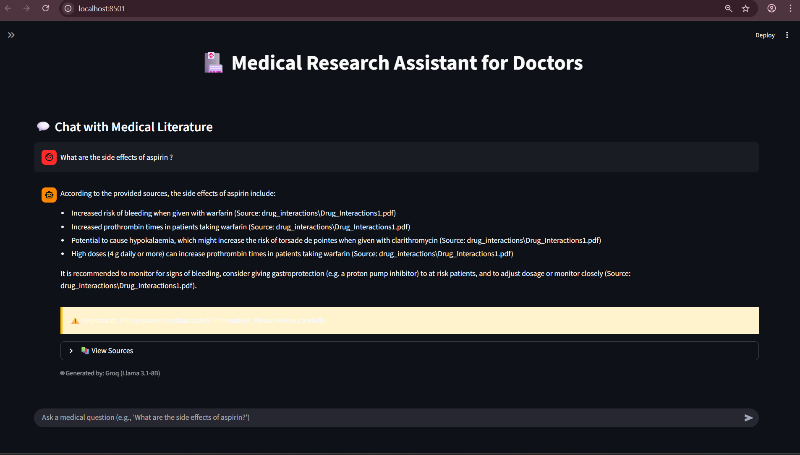
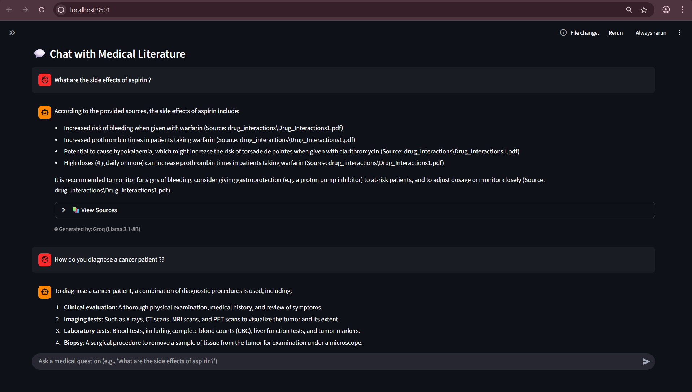
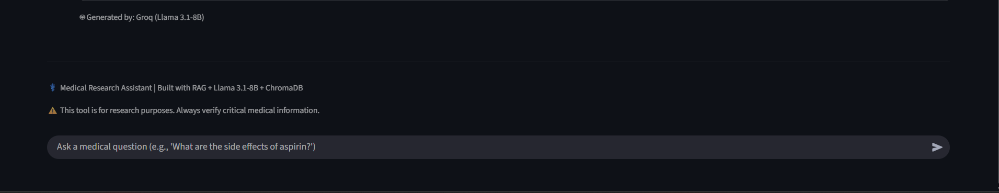

#  Medical Research Assistant for Doctors

##  Project Description
An AI-powered medical assistant designed for doctors to ask clinical questions and receive **grounded, evidence-based answers** using **Retrieval-Augmented Generation (RAG)** and hybrid **LLM fallback orchestration**.

Medical PDFs placed in the `data/` directory are automatically extracted, chunked, embedded, indexed in **ChromaDB**, and retrieved via **semantic similarity search** to minimize hallucinations. Answers are generated using **Llama 3.1-8B via Groq API** with **OpenAI GPT-4o-mini fallback** for robustness.

---

## 🧠 How it Works

**Ingestion:**  
Medical documents in `data/` are auto-loaded, text-extracted, chunked (1500 characters with 300 overlap), embedded using a Sentence Transformer model, and stored in a persistent **ChromaDB vector index**.

**Retrieval:**  
Doctor queries are converted into embeddings and matched against the **vector index** using semantic similarity search. The system retrieves **Top 5 most relevant medical literature chunks** with metadata and relevance scores.

**Hybrid Generation:**  
- **Primary:** Generates answers using **Llama 3.1-8B via Groq API**, strictly grounded in retrieved medical context  
- **Fallback:** Automatically switches to **OpenAI (GPT-4o-mini)** if Groq is unavailable or fails  
- If retrieved documents lack sufficient information, the model responds with a **clear medical disclaimer instead of hallucinating**

---

## 🧩 Tech Stack

- **LangChain:** RAG orchestration framework  
- **ChromaDB:** Vector storage and semantic retrieval  
- **Hugging Face Embeddings:** `sentence-transformers/all-MiniLM-L6-v2`  
- **LLM APIs:** Groq (Llama 3.1-8B-Instant) + OpenAI (GPT-4o-mini fallback)  
- **PDF Processing:** PyMuPDF (`fitz`)  

---

## ✨ Key Features

 **Clinical Context Priority:** Answers only from retrieved medical PDFs  
 **Hybrid RAG:** Falls back to OpenAI if Groq fails  
 **Source Attribution:** Retrieved medical sources displayed in UI + logs  
 **Optimized Retrieval:** 1500-char chunks for full clinical meaning  
 **Drug Safety Alerts:** Highlights drug interactions, adverse effects, contraindications  
 **Robust LLM Fallback:** Auto-switches to OpenAI if Groq fails  
 **Utilities:** python-dotenv, tqdm, numpy, pandas (optional for eval scripts).

---


## 🧠 Core Modules Included
| Module | Purpose |
|---|---|
| `ingest_data.py` | Extracts text from PDFs → splits → embeds → stores in ChromaDB |
| `verify_index.py` | Validates vector index integrity and tests similarity search |
| `rag_pipeline.py` | Embeds doctor query → retrieves top 5 chunks → calls LLM APIs with fallback |
| `evaluate_rag.py` | Benchmarks retrieval quality + answer grounding using RAG metrics |
| `app.py` | Streamlit UI for doctor interaction + source preview + safety alerts |

---


# Images 

Image1
  

Image2
  

Image3
  

Image4
  

Image5
  


# Installation and Setup

1️⃣ Clone the Repository 

```
    git clone https://github.com/Shivp45/MedIntel.git  
    cd MedIntel
```

2️⃣ Activate your virtual environment

```
    python -m venv ai_service  
    ai_service\Scripts\activate
```

3️⃣ Install dependencies

```
    pip install -r requirements.txt
```

4️⃣ Add medical PDFs  
Copy your medical research papers, guidelines, toxicology, drug docs into:

```
    data/*/*
```
5️⃣ Run document ingestion (creates vector DB + index)  
Only if you add new data file/files...

```
    python backend/ingest_data.py   
```
Expected output should show:  
```
    ✔ 32 PDFs detected  
    ✔ ~4688 chunks embedded  
    ✔ Vector DB stored in embeddings/chroma/ (with chroma.sqlite3 inside it)
```

6️⃣ (Optional) Verify vector index is working  

```
    python verify_index.py
```

This will test semantic search like:  

```
    "What are common medical treatments?" → returns 3 similar chunks
```

7️⃣ Run the doctor chat UI  

```
    streamlit run app.py
```

The app will open automatically in your browser at:  

```
    http://localhost:8501
```    


# Flow Diagram  

                    ┌──────────────────────┐
                    │  data/ (PDF files)   │
                    └──────────┬───────────┘
                               ▼
                    ┌──────────────────────┐
                    │  ingest_data.py      │
                    │  - Extract text      │
                    │  - Chunk docs        │
                    │  - Generate embeds   │
                    │  - Store in Chroma   │
                    └──────────┬───────────┘
                               ▼
                    ┌────────────────────────────┐
                    │ embeddings/chroma/ (DB)   │
                    │  Vector Index Stored Here  │
                    └──────────┬────────────────┘
                               ▼
                    ┌──────────────────────┐
                    │  rag_pipeline.py     │
                    │  - Embed query       │
                    │  - Retrieve top K    │
                    │  - Send context → LLM│
                    └──────────┬───────────┘
                               ▼
         ┌────────────── Groq API (Primary LLM) ───────────────┐
         │                Model: Llama 3.1-8B                  │
         └───────────────┬───────────────────────┬─────────────┘
                         │  (if fails 401/timeout)│
                         ▼                       │
         ┌──────────── OpenAI API (Fallback LLM) │
         │           Model: GPT-4o-mini          │
         └────────────┬──────────────────────────┘
                      ▼
                    ┌──────────────────────┐
                    │  app.py (Streamlit UI)│
                    │  - Show answer        │
                    │  - Show sources       │
                    │  - Safety alerts      │
                    └──────────┬───────────┘
                               ▼
                    ┌──────────────────────┐
                    │ evaluate_rag.py      │
                    │ - Retrieval metrics  │
                    │ - Keyword grounding  │
                    └──────────┬───────────┘
                               ▼
                    ┌──────────────────────┐
                    │ verify_index.py      │
                    │ - Test vector search │
                    │ - Check DB integrity │
                    └──────────────────────┘


[Doctor Query] → [Embed Query]
       ↓
[Retrieve Top 5 Chunks from ChromaDB]
       ↓
[Send Context + Query to Groq (Llama 3.1-8B)]
       ↓
{If fails}
       ↓
[OpenAI Fallback (GPT-4o-mini)]
       ↓
[Return Answer + Sources + Safety Warnings]
       ↓
[Display in Streamlit UI]